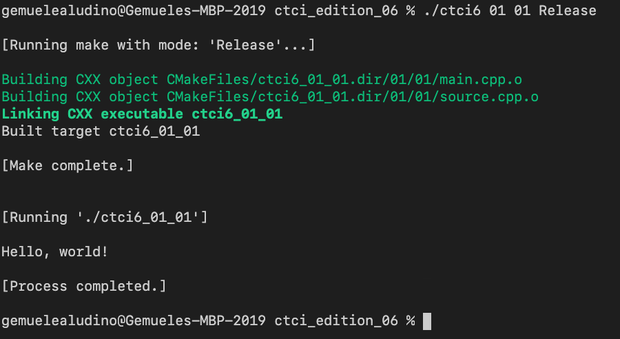

# Cracking the Coding Interview: 6th Edition (in C++)

## This repository
- [Cracking the Coding Interview: 6th Edition (in C++)](#cracking-the-coding-interview-6th-edition-in-c)
  - [This repository](#this-repository)
  - [Foreword](#foreword)
  - [Table of Contents (interview questions)](#table-of-contents-interview-questions)
  - [Quick Start (generate, build, run) on Unix-based systems](#quick-start-generate-build-run-on-unix-based-systems)
    - [Step 0](#step-0)
    - [Step 1](#step-1)
    - [Step 2](#step-2)
  - [More information on building](#more-information-on-building)
  - [Questions I have completed](#questions-i-have-completed)

## Foreword

This repository contains work/solutions for<br>
<i>Cracking the Coding Interview: 6th Edition</i><br> by <b>Gayle Laakmann McDowell</b>.<p>
The sources (will be) written in <b>C++17</b>.<br>
All sources are WIP (work in progress).

I wanted to have a one-stop solution for practicing coding problems;<br>
the [Table of Contents](doc/toc.md) markdown file is hyperlinked with subpages for each chapter --<br>
each chapter page has links to the source files associated with each question.

I am using <b>Visual Studio Code</b> (with a markdown preview extension),<br>
and the Terminal (on macOS).

## Table of Contents (interview questions)

- Chapter `01` | [Arrays and Strings](doc/01.md)
- Chapter `02` | [Linked Lists](doc/02.md)
- Chapter `03` | [Stacks and Queues](doc/03.md)
- Chapter `04` | [Trees and Graphs](doc/04.md)
- Chapter `05` | [Bit Manipulation](doc/05.md)
- Chapter `06` | [Math and Logic Puzzles](doc/06.md)
- Chapter `07` | [Object-Oriented Design](doc/07.md)
- Chapter `08` | [Recursion and Dynamic Programming](doc/08.md)
- Chapter `09` | [System Design and Scalability](doc/09.md)
- Chapter `10` | [Sorting and Searching](doc/10.md)
- Chapter `12` | [C and C++](doc/12.md)
- Chapter `15` | [Threads and Locks](doc/15.md)
- Chapter `16` | [Moderate](doc/16.md)
- Chapter `17` | [Hard](doc/17.md)

## Quick Start (generate, build, run) on Unix-based systems

### Step 0
Please have the following installed on your machine:
- `LLVM (clang)` or `gcc`
- `CMake`

We will use the <b>Terminal</b>.

### Step 1
Use the provided `makebuilds` script to generate <b>Makefiles</b>.
```c
your_username@your-machine ctci_edition_06 % ./makebuilds
```
After the <b>Makefiles</b> are generated,<br>
you will no longer need to use the `makebuilds` script.<br>
(unless you delete the generated <b>Makefiles</b>.)

### Step 2
Then, use the provided `ctci6` script to build & run an executable for a given question.
```c
your_username@your-machine ctci_edition_06 % ./ctci6 01 01
```

<br>

The <b>first argument</b> is the <b>chapter number</b>. (Chapter 01)<br>
The <b>second argument</b> is the <b>question number</b>. (Question 1.1)<br>

There is an <b>implicit third argument</b>, which is the <b>build type</b>.<br>
<code>Debug</code> is the default</code>.<br>

You may supply a <b>third argument</b>; the following are supported:<br>
- <code>Debug</code>
- <code>Release</code>
- <code>RelWithDebInfo</code>
- <code>MinSizeRel</code>

The example below runs the same executable in <code>Release</code> mode.
```c
your_username@your-machine ctci_edition_06 % ./ctci6 01 01 Release
```

<br>

## More information on building
This repository uses <b>CMake</b>. (see https://cmake.org) <p>
Review [Building](doc/building.md) for more details.

## Questions I have completed

See [Completed Question List](doc/QTODO-list.md)<br>
for a checklist of questions I have completed.<br>
<p>I am working on these as needed; <br>I do not expect to get all of these done anytime soon. <p>I suggest that you fork this repository and have your own working copy.
