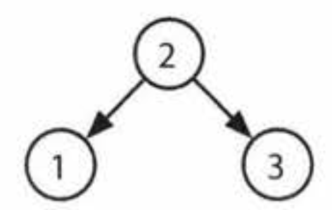

# Cracking the Coding Interview: 6th Edition (in C++)

#### Return to [README](../README.md)
#### See also: [Completed Question List](QTODO-list.md)

## Chapter `04` | Trees and Graphs

### [4.1: Route between Nodes](../src/04/01/main.cpp) `./ctci6 04 01`
- Given a directed graph, design an algorithm to find out whether there is a route between two nodes.

### [4.2: Minimal Tree](../src/04/02/main.cpp) `./ctci6 04 02`
- Given a sorted (increasing order) array with unique integer elements, write an algorithm to create a binary search tree with minimal height.

### [4.3: List of Depths](../src/04/03/main.cpp) `./ctci6 04 03`
- Given a binary tree, design an algorithm which creates a linked list of all the nodes at each depth (e.g. if you have a tree with depth D, you'll have D linked lists)

### [4.4: Check Balanced](../src/04/04/main.cpp) `./ctci6 04 04`
- Implement a function to check if a binary tree is balanced. For the purposes of this question, a balanced tree is defined to be a tree such that the heights of thw two subtrees of any node never differ by more than one.

### [4.5: Validate BST](../src/04/05/main.cpp) `./ctci6 04 05`
- Implement a function to check if a binary tree is a binary search tree.

### [4.6: Successor](../src/04/06/main.cpp) `./ctci6 04 06`
- Write an algorithm to find the "next" node (i.e. in-order successor) of a given node in a binary search tree. You may assume that each node has a link to its parent.

### [4.7: Build Order](../src/04/07/main.cpp) `./ctci6 04 07`
- You are given a list of projects and a list of dependencies (which is a list of pairs of projects, where the second project is dependent on the first project). All of a project's dependencies must be built before the project is. <p>Find a build order that will allow the projects to be built. If there is no valid build order, return an error.

    EXAMPLE<br>
    ```
    Input: 
        projects:       a, b, c, d, e, f
        dependencies:   (a, d), (f, b), (b, d), (f, a), (d, c)

    Output:             f, e, a, b, d, c
    ```

### [4.8: First Common Ancestor](../src/04/08/main.cpp) `./ctci6 04 08`
- Design an algorithm and write code to find the first common ancestor of two nodes in a binary tree. Avoid storing additional nodes in a data structure. <p>NOTE: This is not necessarily a binary search tree.

### [4.9: BST Sequences](../src/04/09/main.cpp) `./ctci6 04 09`
- A binary search tree was created by traversing through an array from left to right and inserting each element. Given a binary search tree with distinct elements, print all possible arrays that could have led to this tree.

    EXAMPLE<br>
    Input:<br>
    <br>
    Output: `{ 2, 1, 3 }, { 2, 3, 1 }`

### [4.10: Check Subtree](../src/04/10/main.cpp) `./ctci6 04 10`
- `T1` and `T2` are two very large binary trees, with `T1` much bigger than `T2`.<p>Create an algorithm to determine if `T2` is a subtree of `T1`. <p>A tree `T2` is a subtree of `T1` if there exists a node n in `T1` such that the subtree of n is identical to `T2.` <p>That is, if you cut off the tree at node `n`, the two trees would be identical.

### [4.11: Random Node](../src/04/11/main.cpp) `./ctci6 04 11`
- You are implementing a binary tree class from scratch which, in addition to `insert`, `find`, and `delete`, has a method `getRandomNode()` which returns a random node from the tree. All nodes should be equally likely to be chosen. <p>Design and implement an algorithm for `getRandomNode`, and explain how you would implement the rest of the methods.

### [4.12: Paths with Sum](../src/04/12/main.cpp) `./ctci6 04 12`
- You are given a binary tree in which each node contains an integer value (which might be positive or negative). <p>Design an algorithm to count the number of paths that sum to a given value. The path does not need to start or end at the root or a leaf, but it must go downwards (traveling only from parent nodes to child nodes).

#### Return to [README](../README.md)
#### See also: [Completed Question List](QTODO-list.md)
