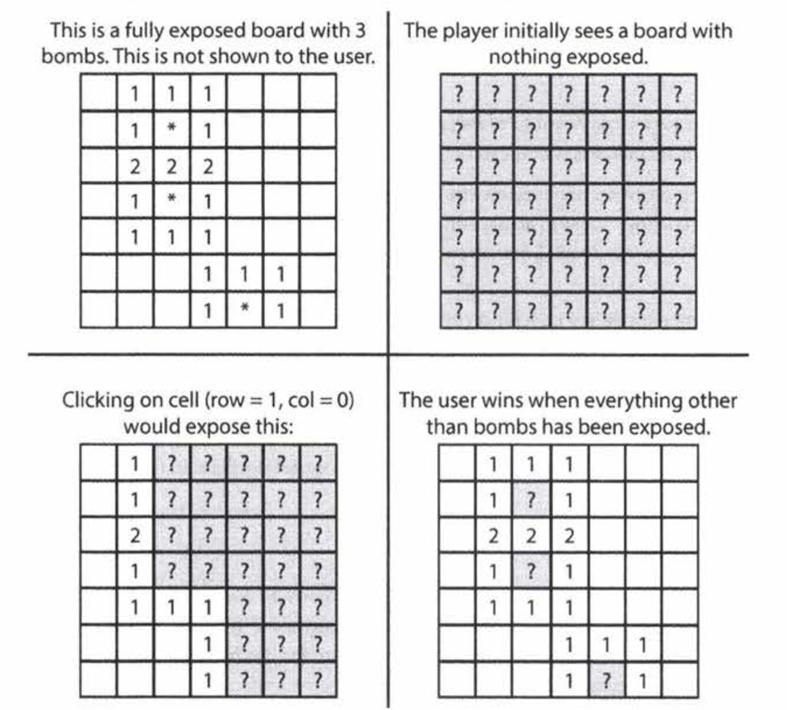

# Cracking the Coding Interview: 6th Edition (in C++)

#### Return to [README](../README.md)
#### See also: [Completed Question List](QTODO-list.md)

## Chapter `07` | Object-Oriented Design

### [7.1: Deck of Cards](../src/07/01/main.cpp) `./ctci6 07 01`
- Design the data structures for a generic deck of cards. Explain how you would subclass the data structures to implement blackjack.
  
### [7.2: Call Center](../src/07/02/main.cpp) `./ctci6 07 02`
- Imagine you have a call center with three levels of employees: respondent, manager, and director. 
An incoming telephone call must be first allocated to a respondent who is free. 
If the respondent can't handle the call, he or she must escalate the call to a manager. 
If the manager is not free or not able to handle it, then the call should be escalated to a director. 
Design the classes and data structures for this problem. Implement a method `dispatchCall()` which assigns a call to the first available employee.

### [7.3: Jukebox](../src/07/03/main.cpp) `./ctci6 07 03`
- Design a musical jukebox using object-oriented principles.
  
### [7.4: Parking Lot](../src/07/04/main.cpp) `./ctci6 07 04`
- Design a parking lot using object-oriented principles.

### [7.5: Online Book Reader](../src/07/05/main.cpp) `./ctci6 07 05`
- Design the data structures for an online book reader system.

### [7.6: Jigsaw](../src/07/06/main.cpp) `./ctci6 07 06`
- Implement an `(N x N)` jigsaw puzzle. Design the data structures and explain an algorithm to solve the puzzle. 
You can assume that you have a `fitsWith` method which, when passed two puzzle edges, returns true if the two edges belong together.

### [7.7: Chat Server](../src/07/07/main.cpp) `./ctci6 07 07`
- Explain how you would design a chat server. In particular, provide details about the various backend components, classes, and methods. What would be the hardest problems to solve?

### [7.8: Othello](../src/07/08/main.cpp) `./ctci6 07 08`
- Othello is played as follows: Each Othello piece is white on one side and black on the other.
When a piece is surrounded by its opponents on both the left and right sides, or both the top and bottom, it is said to be captured and its color is flipped.
On your turn, you must capture at least one of your opponent's pieces. 
The game ends when either user has no more valid moves. The win is assigned to the person with the most pieces. 
Implement the object-oriented design for Othello.

### [7.9: Circular Array](../src/07/09/main.cpp) `./ctci6 07 09`
- Implement a `CircularArray` class that supports an array-like data structure which can be efficiently rotated. 
If possible, the class should use a generic type (also called a `template`), and should support iteration via the standard for `(Obj o : circularArray)` notation.

### [7.10: Minesweeper](../src/07/10/main.cpp) `./ctci6 07 10`
- Design and implement a text-based Minesweeper game. 
Minesweeper is the classic single-player computer game where an `(N x N)` grid has B mines (or bombs) hidden across the grid. 
The remaining cells are either blank or have a number behind them. 
The numbers reflect the number of bombs in the surrounding eight cells. 
The user then uncovers a cell. 
If it is a bomb, the player loses.  If it is a number, the number is exposed.  If it is a blank cell, this cell and all adjacent blank cells (up to and including the surrounding numeric cells) are exposed. 
The player wins when all non-bomb cells are exposed. 
The player can also flag certain places as potential bombs. This doesn't affect game play, other than to block the user from accidentally clicking a cell that is thought to have a bomb. 
(Tip for the reader: if you're not familiar with this game, please playa few rounds online first.)

 

### [7.11: File System](../src/07/11/main.cpp) `./ctci6 07 11`
- Explain the data structures and algorithms that you would use to design an in-memory file system. Illustrate with an example in code where possible.

### [7.12: Hash Table](../src/07/12/main.cpp) `./ctci6 07 12`
- Design and implement a hash table which uses chaining (linked lists) to handle collisions.

#### Return to [README](../README.md)
#### See also: [Completed Question List](QTODO-list.md)
