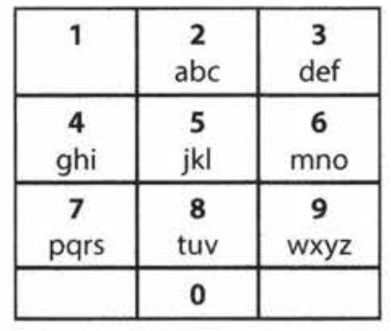

# Cracking the Coding Interview: 6th Edition (in C++)

#### Return to [README](../README.md)
#### See also: [Completed Question List](QTODO-list.md)

## Chapter `16` | Moderate

### [16.1: Number Swapper](../src/16/01/main.cpp) `./ctci6 16 01`
- Write a function to swap a number in place (that is, without temporary variables).

### [16.2: Word Frequencies](../src/16/02/main.cpp) `./ctci6 16 02`
- Design a method to find the frequency of occurrences of any given word in a book. What if we were running this algorithm multiple times?

### [16.3: Intersection](../src/16/03/main.cpp) `./ctci6 16 03`
- Given two straight line segments (represented as a start point and an end point), compute the point of intersection, if any.

### [16.4: Tic Tac Win](../src/16/04/main.cpp) `./ctci6 16 04`
- Design an algorithm to figure out if someone has won a game of tic-tac-toe.

### [16.5: Factorial Zeros](../src/16/05/main.cpp) `./ctci6 16 05`
- Write an algorithm which computes the number of trailing zeros in `n` factorial.

### [16.6: Smallest Difference](../src/16/06/main.cpp) `./ctci6 16 06`
- Given two arrays of integers, compute the pair of values (one value in each array) with the smallest (non-negative) difference. Return the difference.

    EXAMPLE<br>
    ```
    Input:  { 1, 3, 15, 11, 2 }, { 23, 127, 235, 19, 8 }
    Output: 3.  That is, the pair (11, 8).
    ```

### [16.7: Number Max](../src/16/07/main.cpp) `./ctci6 16 07`
- Write a method that finds the maximum of two numbers. You should not use `if-else` or any other comparison operator.

### [16.8: English Int](../src/16/08/main.cpp) `./ctci6 16 08`
- Given any integer, print an English phrase that describes the integer <br>(e.g., "One Thousand, Two Hundred Thirty Four").

### [16.9: Operations](../src/16/09/main.cpp) `./ctci6 16 09`
- Write methods to implement the multiply, subtract, and divide operations for integers. <br>The results of all of these are integers. Use only the add operator.

### [16.10: Living People](../src/16/10/main.cpp) `./ctci6 16 10`
- Given a list of people with their birth and death years, implement a method to compute the year with the most number of people alive. You may assume that all people were born between 1900 and 2000 (inclusive). If a person was alive during any portion of that year, they should be included in that year's count. For example, `Person(birth = 1908, death = 1909)` is included in the counts for both 1908 and 1909.

### [16.11: Diving Board](../src/16/11/main.cpp) `./ctci6 16 11`
- You are building a diving board by placing a bunch of planks of wood end-to-end. There are two types of planks, one of length shorter and one of length longer. You must use exactly `K` planks of wood. Write a method to generate all possible lengths for the diving board.
  
### [16.12: XML Encoding](../src/16/12/main.cpp) `./ctci6 16 12`
- Since XML is very verbose, you are given a way of encoding it where each tag gets mapped to a pre-defined integer value. The language/grammar is as follows:

    ```
    Element     --> Tag Attributes END Children END
    Attribute   --> Tag Value
    END         --> 0
    Tag         --> some predefined mapping to int
    Value       --> string value
    ```
    For example, the following XML might be converted into the compressed string below <br>(assuming a mapping <br>`family -> 1`, `person -> 2`, `firstName -> 3`, `lastName -> 4`, `state -> 5`)
    ```
    <family lastName="McDowell" state="CA">
        <person firstName="Gayle">Some Message</person>
    </family>
    ```
    Becomes:
    ```
    1 4 McDowell 5 CA 0 2 3 Gayle 0 Some Message 0 0
    ```
    Write code to print the encoded version of an XML element <br>(passed in `Element` and `Attribute` objects)

### [16.13: Bisect Squares](../src/16/13/main.cpp) `./ctci6 16 13`
- Given two squares on a two-dimensional plane, find a line that would cut these two squares in half. Assume that the top and the bottom sides of the square run parallel to the x-axis.

### [16.14: Best Line](../src/16/14/main.cpp) `./ctci6 16 14`
- Given a two-dimensional graph with points on it, find a line which passes the most number of points.

### [16.15: Master Mind](../src/16/15/main.cpp) `./ctci6 16 15`
- The Game of Master Mind is played as follows: <p>The computer has four slots, <br>and each slot will contain a ball that is `red (R)`, `yellow (V)`, `green (G`) or `blue (B)`. <p>For example, the computer might have `RGGB` <br>(Slot #1 is `red`, Slots #2 and #3 are `green`, Slot #4 is `blue`). <p>You, the user, are trying to guess the solution. <br>You might, for example, guess `YRGB`. <p>When you guess the correct color for the correct slot, you get a "hit". <br>If you guess a color that exists but is in the wrong slot, you get a "pseudo-hit". <p>Note that a slot that is a hit can never count as a pseudo-hit. <br>For example, if the actual solution is `RGBY` and you guess `GGRR`, <br>you have one hit and one pseudo-hit. <p>Write a method that, given a guess and a solution, returns the number of hits and pseudo-hits.

### [16.16: Sub Sort](../src/16/16/main.cpp) `./ctci6 16 16`
- Given an array of integers, write a method to find indices `m` and `n` such that if you sorted elements `m` through `n`, the entire array would be sorted. Minimize `n - m` (that is, find the smallest such sequence).

    EXAMPLE<br>
    ```
    Input:  1, 2, 4, 7, 10, 11, 7, 12, 6, 7, 16, 18, 19
    Output: (3, 9)
    ```

### [16.17: Contiguous Sequence](../src/16/17/main.cpp) `./ctci6 16 17`
- You are given an array of integers (both positive and negative). Find the contiguous sequence with the largest sum. Return the sum.

    EXAMPLE<br>
    ```
    Input:  2, -8, 3, -2, -4, -10
    Output: 5 (i.e. { 3, -2, 4 })
    ```

### [16.18: Pattern Matching](../src/16/18/main.cpp) `./ctci6 16 18`
- You are given two strings, `pattern` and `value`. <br>The pattern string consists of just the letters `a` and `b`, describing a pattern within a string. <p>For example, the string `catcatgocatgo` matches the pattern `aabab` (where `cat` is `a` and `go` is `b`). <br>It also matches patterns like `a`, `ab`, and `b`.<p>Write a method to determine if `value` matches `pattern`.

### [16.19: Pond Sizes](../src/16/19/main.cpp) `./ctci6 16 19`
- You have an integer matrix representing a plot of land, <br>where the value at that location represents the height above sea level. <p>A value of zero indicates water. <br>A pond is a region of water connected vertically, horizontally, or diagonally. <p>The size of the pond is the total number of connected water cells. <p>Write a method to compute the sizes of all ponds in the matrix.

    EXAMPLE<br>
    ```
    Input:
        0   2   1   0
        0   1   0   1
        1   1   0   1
        0   1   0   1

    Output:
        2,  4,  1   (in any order)
    ```

### [16.20: T9](../src/16/20/main.cpp) `./ctci6 16 20`
- On old cell phones, users typed on a numeric keypad and the phone would provide a list of words that matched these numbers. Each digit mapped to a set of 0 - 4 letters. <p>Implement an algorithm to return a list of matching words, given a sequence of digits. <br>You are provided a list of valid words (provided in whatever data structure you'd like). <p>The mapping is shown in the diagram below: <p><br>

    EXAMPLE<br>
    ```
    Input:  8733
    Output: tree, used
    ```

### [16.21: Sum Swap](../src/16/21/main.cpp) `./ctci6 16 21`
- Given two arrays of integers, find a pair of values (one value from each array) that you can swap to give the two arrays the same sum.

    EXAMPLE<br>
    ```
    Input:  { 4, 1, 2, 1, 1, 2 } and { 3, 6, 3, 3 }
    Output: { 1, 3 }
    ```

### [16.22: Langton's Ant](../src/16/22/main.cpp) `./ctci6 16 22`
- An ant is sitting on an infinite grid of white and black squares. It initially faces right. <br>At each step, it does the following: 
  - (1) At a white square, flip the color of the square, turn 90 degrees right (clockwise), and move forward one unit.
  - (2) At a black square, flip the color of the square, turn 90 degrees left (counter-clockwise), and move forward one unit.
  <p>Write a program to simulate the first `K` moves that the ant makes and print the final board as a grid.<br>Note that you are not provided with the data structure to represent the grid.<br>This is something you must design yourself.<br>The only input to your method is `K`.<p>You should print the final grid and return nothing. <br>The method signature might be something like <code>void printKMoves(int k)</code>.

### [16.23: Rand7 from Rand5](../src/16/23/main.cpp) `./ctci6 16 23`
- Implement a method `rand7()` given `rand5()`. That is, given a method that generates a random number between 0 and 4 (inclusive), write a method that generates a random number between 0 and 6 (inclusive).

### [16.24: Pairs with Sum](../src/16/24/main.cpp) `./ctci6 16 24`
- Design an algorithm to find all pairs of integers within an array which sum to a specified value.

### [16.25: LRU Cache](../src/16/25/main.cpp) `./ctci6 16 25`
- Design and build a "least recently used" cache, which evicts the least recently used item. <p>The cache should map from keys to values (allowing you to insert and retrieve a value associated with a particular key) and be initialized with a max size. <p>When it is full, it should evict the least recently used item.

### [16.26: Calculator](../src/16/26/main.cpp) `./ctci6 16 26`
- Given an arithmetic equation consisting of positive integers, `+`, `-`, `*` and `/` (no parentheses), compute the result.

    EXAMPLE<br>
    ```
    Input:  2 * 3 + 5 / 6 * 3 + 15
    Output: 23.5
    ```

#### Return to [README](../README.md)
#### See also: [Completed Question List](QTODO-list.md)
