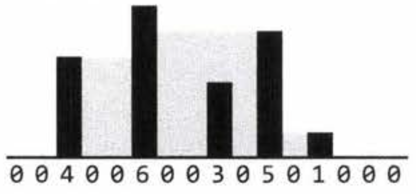

# Cracking the Coding Interview: 6th Edition (in C++)

#### Return to [README](../README.md)
#### See also: [Completed Question List](QTODO-list.md)

## Chapter `17` | Hard

### [17.1: Add Without Plus](../src/17/01/main.cpp) `./ctci6 17 01`
- Write a function that adds two numbers. You should not use `+` or any arithmetic operators.

### [17.2: Shuffle](../src/17/02/main.cpp) `./ctci6 17 02`
- Write a method to shuffle a deck of cards. It must be a perfect shuffle -- <br>in other words, each of the `52!` permutations of the deck has to be equally likely. <br>Assume that you are given a random number generator which is perfect.

### [17.3: Random Set](../src/17/03/main.cpp) `./ctci6 17 03`
- Write a method to randomly generate a set of `m` integers from an array of size n. <br>Each element must have equal probability of being chosen.

### [17.4: Missing Number](../src/17/04/main.cpp) `./ctci6 17 04`
- An array `A` contains all the integers from 0 to `n`, except for one number which is missing. In this problem, we cannot access an entire integer in `A` with a single operation. <p>The elements of `A` are represented in binary, and the only operation we can use to access them is "fetch the `j`th bit of `A[i]`", which takes constant time. <p>Write code to find the missing integer. Can you do it in `O(n)` time?

### [17.5: Letters and Numbers](../src/17/05/main.cpp) `./ctci6 17 05`
- Given an array filled with letters and numbers, find the longest subarray with an equal number of letters and numbers.

### [17.6: Count of 2s](../src/17/06/main.cpp) `./ctci6 17 06`
- Write a method to count the number of 2s that appear in all the numbers between 0 and `n` (inclusive).

    EXAMPLE<br>
    ```
    Input:  25
    Output: 9   (2, 12, 20, 21, 22, 23, 24, and 25. Note that 22 counts for two 2s.)
    ```

### [17.7: Baby Names](../src/17/07/main.cpp) `./ctci6 17 07`
- Each year, the government releases a list of the 10000 most common baby names and their frequencies (the number of babies with that name). <br>The only problem with this is that some names have multiple spellings. <p>For example, "John" and "Jon" are essentially the same name but would be listed separately in the list. <p>Given two lists, one of names/frequences and the other of pairs of equivalent names, <br>write an algorithm to print a new list of the true frequency of each name. <p>Note that if John and Jon are synonyms, and Jon and Johnny are synonyms, then John and Johnny are synonyms. (It is both transitive and symmetric.) <p>In the final list, any name can be used as the "real" name.

    EXAMPLE<br>
    ```
    Input:
        Names:  John (15), Jon (12), Chris (13), Kris (4), Christopher (19)
        Synonyms: (Jon, John), (John, Johnny), (Chris, Kris), (Chris, Christopher)

    Output:
        John (27), Kris (36)
    ```

### [17.8: Circus Tower](../src/17/08/main.cpp) `./ctci6 17 08`
- A circus is designing a tower routine consisting of people standing atop one another's shoulders. For practical and aesthetic reasons, each person must be both shorter and lighter than the person below him or her. Given the heights and weights of each person in the circus, write a method to compute the largest possible number of people in such a tower.

    EXAMPLE<br>
    ```
    Input (ht, wt):
        (65, 100) (70, 150) (56, 90) (75, 190) (60, 95) (68, 110)

    Output:
        The longest tower is length 6 and includes from top to bottom:
        (56, 90) (60, 95) (65, 100), (68, 110), (70, 150), (75, 190)
    ```

### [17.9: Kth Multiple](../src/17/09/main.cpp) `./ctci6 17 09`
- Design an algorithm to find the kth number such that the only prime factors are 3, 5, and 7. <br>Note that 3, 5, and 7 do not have to be factors, but it should not have any other prime factors. <br>For example, the first several multiples would be (in order) 1, 3, 5, 7, 9, 15, 21.

### [17.10: Majority Element](../src/17/10/main.cpp) `./ctci6 17 10`
- A majority element is an element that makes up more than half of the items in an array. <br>Given a positive integers array, find the majority element. <br>If there is no majority element, return -1. Do this in `O(n)` time and `O(1)` space.

    EXAMPLE<br>
    ```
    Input:  1  2  5  9  5  9  5  5  5
    Output: 5
    ```

### [17.11: Word Distance](../src/17/11/main.cpp) `./ctci6 17 11`
- You have a large text file containing words. Given any two words, find the shortest distance (in terms of number of words) between them in the file. If the operation will be repeated many times for the same file (but different pairs of words), can you optimize your solution?

### [17.12: BiNode](../src/17/12/main.cpp) `./ctci6 17 12`
- Consider a simple data structure called `BiNode`, which has pointers to two other nodes.

    ```c
    class BiNode {
    public:
        BiNode *node1, *node2;
        int data;
    };
    ```
    The data structure `BiNode` could be used to represent both <br>a binary tree <br>(where `node1` is the left node and `node2` is the right node) <br>or a doubly linked list <br>(where `node1` is the previous node and `node2` is the next node).<p>Implement a method to convert a binary search tree <br>(implemented with `BiNode`) into a doubly linked list. <p>The values should be kept in order and the operation should be performed in-place <br>(that is, on the original data structure).

### [17.13: Re-Space](../src/17/13/main.cpp) `./ctci6 17 13`
- Oh no! You have accidentally removed all spaces, punctuation, and capitalization in a lengthy document.<p> A sentence like "`I reset the computer. It still didn't boot!`" became<br>"`iresetthecomputeritstilldidntboot`".<p>You'll deal with the punctuation and capitalization later; right now, you need to re-insert the spaces.<p>Most of the words are in a dictionary but a few are not.<p>Given a dictionary (a list of strings) and the document (a string), design an algorithm to unconcatenate the document in a way that minimizes the number of unrecognized characters.

    EXAMPLE<br>

    Input: <code>jesslookedjustliketimherbrother</code><br>
    Output: <code><u>jess</u> looked just like <u>tim</u> her brother</code> (7 unrecognized characters)
    

### [17.14: Smallest K](../src/17/14/main.cpp) `./ctci6 17 14`
- Design an algorithm to find the smallest `K` numbers in an array.

### [17.15: Longest Word](../src/17/15/main.cpp) `./ctci6 17 15`
- Given a list of words, write a program to find the longest word made of other words in the list.

    EXAMPLE<br>
    ```
    Input:  cat, banana, dog, nana, walk, walker, dogwalker
    Output: dogwalker
    ```

### [17.16: The Masseuse](../src/17/16/main.cpp) `./ctci6 17 16`
- A popular masseuse receives a sequence of back-to-back appointment requests <br>and is debating which ones to accept. <p>She needs a 15-minute break between appointments <br>and therefore she cannot accept any adjacent requests. <p>Given a sequence of back-to-back appointment requests <br>(all multiples of 15 minutes, none overlap, and none can be moved), <br>find the optimal (highest total booked minutes) set the masseuse can honor. <p>Return the number of minutes.

### [17.17: Multi Search](../src/17/17/main.cpp) `./ctci6 17 17`
- Given a string `b` and an array of smaller strings `T`, design a method to search `b` for
each small string in `T`.

### [17.18: Shortest Supersequence](../src/17/18/main.cpp) `./ctci6 17 18`
- You are given two arrays, one shorter (with all distinct elements) and one longer. Find the shortest subarray in the longer array that contains all the elements in the shorter array. The items can appear in any order.

    EXAMPLE<br>
    Input:  <code>{ 1, 5, 9 } | { 7, 5, 9, 0, 2, 1, 3, <u>5, 7, 9, 1,</u> 1, 5, 8, 8, 9, 7 }</code><br>
    Output: <code>[7, 10] (the underlined portion above)</code>


### [17.19: Missing Two](../src/17/19/main.cpp) `./ctci6 17 19`
- You are given an array with all the numbers from 1 to `N` appearing exactly once, except for one number that is missing. How can you find the missing number in `0(N)` time and `0(1)` space? What if there were two numbers missing?

### [17.20: Continuous Median](../src/17/20/main.cpp) `./ctci6 17 20`
- Numbers are randomly generated and passed to a method. Write a program to find and maintain the median value as new values are generated.

### [17.21: Volume of Histogram](../src/17/21/main.cpp) `./ctci6 17 21`
- Imagine a histogram (bar graph). Design an algorithm to compute the volume of water it could hold if someone poured water across the top. You can assume that each histogram bar has width 1.
  
    EXAMPLE<br>
    ```
    Input: { 0, 0, 4, 0, 0, 6, 0, 0, 3, 0, 5, 0, 1, 0, 0, 0 }
    ```
    <br>
    ```
    Output: 26
    ```

### [17.22: Word Transformer](../src/17/22/main.cpp) `./ctci6 17 22`
- Given two words of equal length that are in a dictionary, write a method to transform one word into another word by changing only one letter at a time. The new word you get in each step must be in the dictionary.

    EXAMPLE<br>
    ```
    Input:  DAMP, LIKE
    Output: DAMP -> LAMP -> LIMP -> LIME -> LIKE
    ```

### [17.23: Max Black Square](../src/17/23/main.cpp) `./ctci6 17 23`
- Imagine you have a square matrix,where each cell (pixel) is either black or white.<p>Design an algorithm to find the maximum subsquare <br>such that all four borders are filled with black pixels.

### [17.24: Max Submatrix](../src/17/24/main.cpp) `./ctci6 17 24`
- Given an (`N x N`) matrix of positive and negative integers, <br>write code to find the submatrix with the largest possible sum.

### [17.25: Word Rectangle](../src/17/25/main.cpp) `./ctci6 17 25`
- Given a list of millions of words, <br>design an algorithm to create the largest possible rectangle of letters <br>such that every row forms a word (reading left to right) <br>and every column forms a word (reading top to bottom). <p>The words need not be chosen consecutively from the list, <br>but all rows must be the same length and all columns must be the same height.

### [17.26: Sparse Similarity](../src/17/26/main.cpp) `./ctci6 17 26`
- The similarity of two documents (each with distinct words) is defined to be the size of the intersection divided by the size of the union. <p>For example, if the documents consist of integers, <br>the similarity of `{ 1, 5, 3 }` and `{ 1, 7, 2, 3 }` is `0.4`, <br>because the intersection has size 2 and the union has size 5. <p>We have a long list of documents (with distinct values and each with associate ID) where the similarity is believed to "sparse". That is, any two arbitrarily selected documents are very likely to have similarity 0. <p>Design an algorithm that returns a list of pairs of document IDs and the associated similarity. <br>Print only the pairs with similarity greater than 0. <p>Empty documents should not be printed at all. <br>For simplicity, you may assume each document is represented as an array of distinct integers.

    EXAMPLE<br>
    ```
    Input:
        13: { 14, 15, 100, 9, 3 }
        16: { 32,  1,   9, 3, 5 }
        19: { 15, 29,   2, 6, 8, 7 }
        24: {  7, 10 }

    Output:
        ID1, ID2 : SIMILARITY
        13, 19   : 0.1
        13, 16   : 0.25
        19, 24   : 0.14285714285714285
    ```

#### Return to [README](../README.md)
#### See also: [Completed Question List](QTODO-list.md)
