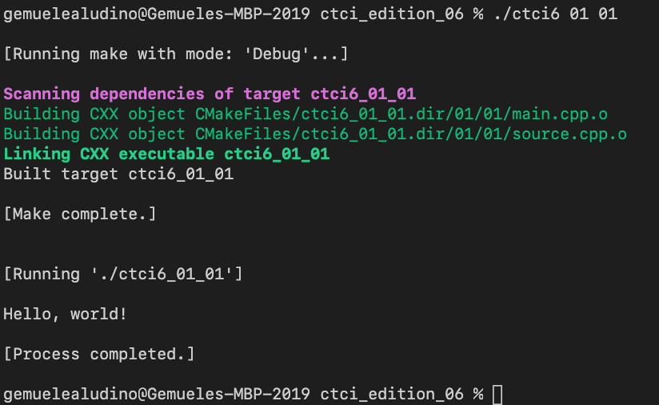
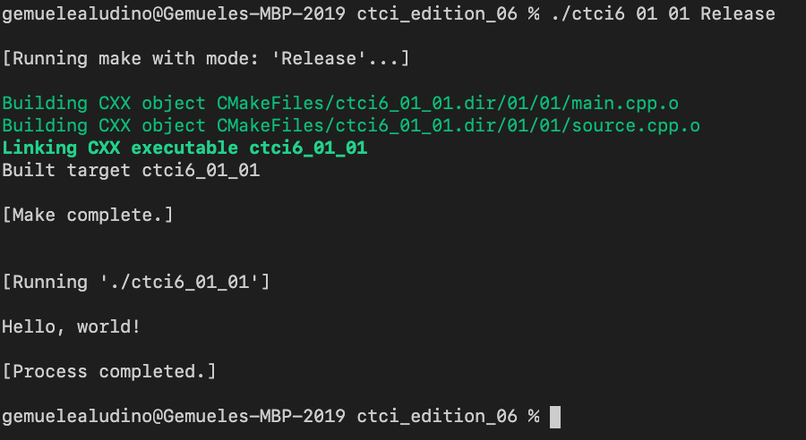
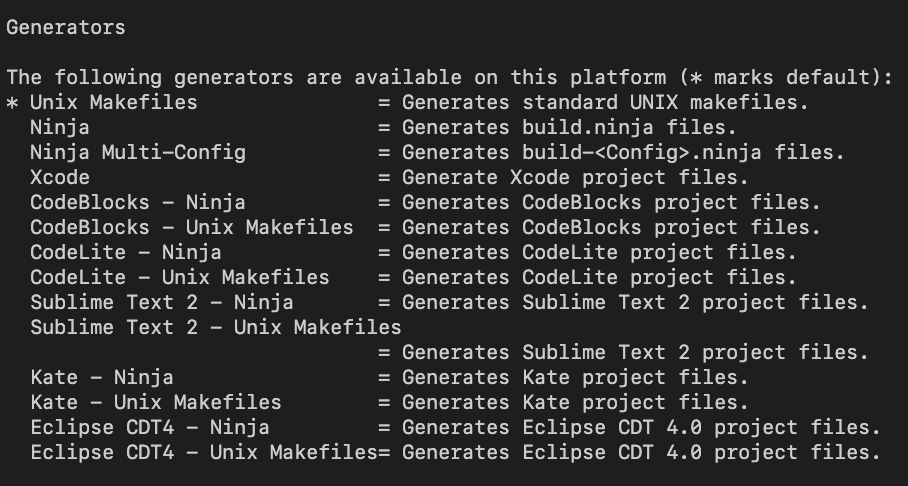

# Cracking the Coding Interview: 6th Edition (in C++)

#### Return to [README](../../README.md)

## Building with Makefiles
### Build types
The provided `makebuilds` script will create <b>Unix Makefiles</b><br>
for the following build types:

- <code>Debug</code>
- <code>Release</code>
- <code>RelWithDebInfo</code>
- <code>MinSizeRel</code>

### Using the <code>makebuilds</code> script
Use the `makebuilds` script in the <b>Terminal</b> as follows: 

```c
your_username@your-machine ctci_edition_06 % ./makebuilds
```

This will generate separate <b>Makefiles</b> for the build types described above, using CMake.

### Using the <code>ctci6</code> script
After generating the Makefiles,<br>
You may then use the included `ctci6` script to build and run<br>
the executable for a given question.

For example,<br>
to build and run the executable for
- <b>Chapter 01: Arrays and Strings</b>, question <b>1.1</b>

```c
your_username@your-machine ctci_edition_06 % ./ctci6 01 01
```

The <b>first argument</b> is the <b>chapter number</b>.<br>
The <b>second argument</b> is the <b>question number</b>.<br>

There is an <b>implicit third argument</b>, which is the <b>build type</b>. <br>
<code>Debug</code> is the default</code>.

<br>

You can build the same question described above in <code>Release</code> mode like this:
```c
your_username@your-machine ctci_edition_06 % ./ctci6 01 01 Release
```

<br>

## Building with another generator

By using
```c
your_username@your-machine ctci_edition_06 % cmake -help
```
you can review the supported generators on your local machine.<p>



For example, to use the <b>Xcode</b> project file generator (for the <b>Xcode IDE</b> on <b>macOS</b>):<br>
```c
your_username@your-machine ctci_edition_06 % cmake -S ./ -B ./build/xcode -G "Xcode"
```
You can change the executable/build type within the Xcode IDE.

Please read the instructions for your specific IDE to determine how to proceed,<br>
after generating the necessary project files from <b>CMake</b>.

#### Return to [README](../../README.md)
